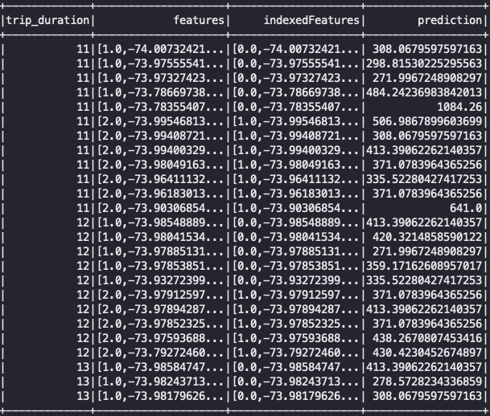

# Pyspark-NYC-taxi-trip-duration-analysis
Used pyspark to make prediction on taxi trip duration.

## Data source
[New York City Taxi Trip Duration](https://www.kaggle.com/c/nyc-taxi-trip-duration/overview)  
The dataset is from competition of kaggle competition.  
Dataset stores thousands of records of taxi trips, and related information about pickup and dropoff. In this project, I plan to use decision tree from `pyspark.ml` to predict the trip duration with according features.

## Source code
`train.py`: source code to train model and make predictions
`visual.py`: source code to visualize the relationship between features

## Detail
The workflow for my program included:  
1. Data preprocessing
Feature engineering
Remove outliers
2. Build up decision tree model
3. Cross validation to tune parameters
4. Evaluation with RMSE and MAE

The features I used to train the model included pickup and dropoff longitude/latitude, passenger count, and distance calculated by **Haversine formula**.

## Result

```
Here is the result of RMSE with regression tree: 570.5827222331603
Here is the result of MAE with regression tree: 230.20768680470164
```

## Conclusion
From the result, I think this dataset is not appropriate for using decision tree mode; however what's interesting, the result can be approved by **enhanced decision tree**, which make models of linear regression on each leaves from decision tree.